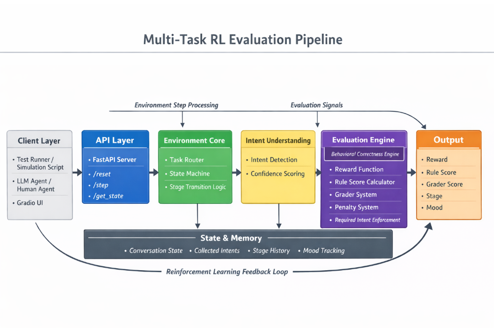

# 🚀 Multi-Task BPO RL Environment

### 🧠 A Structured Evaluation & Training Platform for Customer Support Agents


[](https://huggingface.co/spaces/rajaguru2004/bpo_env)

---

## 🧠 Overview

This project is a **multi-task reinforcement learning (RL) environment** designed to **simulate and evaluate customer support agent behavior** across real-world scenarios.

> [!IMPORTANT]
> **This is NOT just a chatbot or an evaluation tool.**
> It is a **controlled, deterministic, behavior-enforcing RL environment** that actively ensures agents follow structured workflows.

Unlike traditional chatbot systems that only generate responses, this environment focuses on:

> 🎯 **Evaluating and enforcing** whether an agent behaves correctly — not just what it says

---

## 📋 Table of Contents

- [🛠️ Setup Guide (Local)](#️-setup-guide-local)
  - [Step 0 — Configure your .env](#step-0--configure-your-env)
  - [Step 1 — Activate Virtual Environment](#step-1--activate-virtual-environment)
  - [Step 2 — Build the Docker Image](#step-2--build-the-docker-image)
  - [Step 3 — Run the Server](#step-3--run-the-server)
  - [Step 4 — Run LLM Agent Inference](#step-4--run-llm-agent-inference-inferencepy)
  - [Step 5 — Run Predefined Scenarios](#step-5--run-predefined-scenario-suite)
  - [Step 6 — Stress Testing & Robustness](#step-6--stress-testing--robustness)

- [🌐 Deployed Environment (HuggingFace)](#-deployed-environment-huggingface)
- [🔥 Key Features](#-key-features)
  - [🧠 Advanced Agent Control & Recovery System](#-advanced-agent-control--recovery-system)
  - [🎯 Deterministic Behavior Enforcement Layer](#-deterministic-behavior-enforcement-layer)
  - [🧠 Adaptive Response Intelligence](#-adaptive-response-intelligence)
  - [⚡ Stress-Tested Robustness System](#-stress-tested-robustness-system)
- [🏗️ System Architecture](#️-system-architecture)
- [🧪 Supported Scenarios](#-supported-scenarios)
- [📊 Evaluation Metrics](#-evaluation-metrics)
- [⚖️ Note on Evaluation Approach](#️-note-on-evaluation-approach)
- [🏆 What Makes This System Unique](#-what-makes-this-system-unique)
- [⚡ Future Roadmap](#-future-roadmap)
- [🧰 Tech Stack](#-tech-stack)
- [👥 Team](#-team--skill-hive)

---

## 🛠️ Setup Guide (Local)

Follow these steps **in order** to get the environment running on your machine.

---

### Step 0 — Configure your `.env`

A template file `.env.copy` is provided in the project root. Before anything else, fill in your credentials and rename it to `.env`.

**1. Open `.env.copy` and fill in your values:**

```env
API_KEY="<YOUR_API_KEY>"
HF_TOKEN="<YOUR_HUGGINGFACE_TOKEN>"

API_BASE_URL="https://router.huggingface.co/v1"
MODEL_NAME="Qwen/Qwen2.5-72B-Instruct"

SERVER_URL="http://localhost:8000"
LOCAL_IMAGE_NAME="openenv-bpo:latest"
```

| Variable | Description |
|---|---|
| `API_KEY` | Primary API key for the LLM provider (e.g., OpenRouter or HF) |
| `HF_TOKEN` | Your HuggingFace access token (used as fallback for `API_KEY`) |
| `API_BASE_URL` | Base URL for the LLM provider (default: HuggingFace router) |
| `MODEL_NAME` | Model to use as the LLM agent |
| `SERVER_URL` | URL where the BPO server will be running |
| `LOCAL_IMAGE_NAME` | Docker image name used for local dev |


**2. Rename the file:**

```bash
cp .env.copy .env
```

> ⚠️ **Important:** Never commit the `.env` file to version control. It contains secret credentials.

---

### Step 1 — Set Up & Activate Virtual Environment

This project uses [`uv`](https://github.com/astral-sh/uv) for fast dependency management.

```bash
# Install uv (only needed once)
pip install uv

# Create the virtual environment and install all dependencies
uv sync

# Activate the virtual environment

# Linux / macOS
source .venv/bin/activate

# Windows (Command Prompt)
.venv\Scripts\activate.bat

# Windows (PowerShell)
.venv\Scripts\Activate.ps1
```

After activation, your terminal prompt will show `(openenv-bpo-env)` at the start, confirming the environment is active.

> 💡 Run `uv sync` only once (or whenever dependencies change). Run the activate command every time you open a new terminal.

---

### Step 2 — Build the Docker Image

Use the `openenv` CLI to build the Docker image for the BPO environment:

```bash
openenv build
```

This will produce a Docker image named:

```
openenv-bpo:latest
```

> 💡 Make sure Docker is running before executing this command. You can verify with `docker info`.

---

### Step 3 — Run the Server

Start the BPO environment server using Docker:

```bash
docker run -p 8000:8000 openenv-bpo:latest
```

The server will be **up and running at `http://localhost:8000`**.

You can verify it's running by opening:
- **Web Interface:** [http://localhost:8000/web](http://localhost:8000/web)
- **API Docs:** [http://localhost:8000/docs](http://localhost:8000/docs)
- **Health Check:** [http://localhost:8000/health](http://localhost:8000/health)

> ✅ Keep this terminal open. The server must be running for all subsequent steps.

---

### Step 4 — Run LLM Agent Inference (`inference.py`)

The `inference.py` script runs the live LLM agent against the entire set of conversation tasks.

```bash
python inference.py
```

By default, this will sequentially execute the full production evaluation for all 3 tasks:
1. **Easy** (`order_status`)
2. **Medium** (`damaged_product`)
3. **Hard** (`escalation`)

---

### Step 5 — Run Predefined Scenario Suite

For comprehensive benchmarking with **predefined scripted test cases**, use `run_scenarios.py`:

```bash
python run_scenarios.py --url http://localhost:8000 --task order_status
```

**Switch tasks using the `--task` flag:**

```bash
# Order Status scenarios
python run_scenarios.py --url http://localhost:8000 --task order_status

# Escalation scenarios
python run_scenarios.py --url http://localhost:8000 --task escalation

# Run ALL tasks sequentially
python run_scenarios.py --all-tasks
```

---

### Step 6 — Stress Testing & Robustness

To verify that the environment and agent can handle noisy, incomplete, or repetitive inputs without collapsing, use the **Stress Test Mode**:

```bash
# Run stress tests for a specific task
python run_scenarios.py --task order_status --stress

# Run the complete stress suite across all tasks
python run_scenarios.py --all-tasks --stress
```

The stress suite validates three key robustness criteria:
1. **No Collapse**: Rewards stay stable even with noisy/garbled inputs.
2. **Anti-Stalling**: Prevents infinite loops when users repeat prompts.
3. **Recovery**: Ensures agents can "unstick" themselves after a low-reward turn.


**Full usage:**

```
usage: run_scenarios.py [-h] [--url URL] [--task {order_status,damaged_product,escalation}] [--output OUTPUT] [--stress] [--all-tasks]

options:
  --url       URL of the running BPO server (default: http://localhost:8000)
  --task      Task type to evaluate (choices: order_status, damaged_product, escalation)
  --output    Path to save JSON results (default: scenario_results.json)
  --stress    Run stress test scenarios (noisy inputs, incomplete queries, repeated prompts)
  --all-tasks Run scenarios for all 3 tasks sequentially
```

Results are printed as a **structured performance table** and also saved to `scenario_results.json`.


---

## 🌐 Deployed Environment (HuggingFace)

The BPO environment is **already deployed** and available publicly on HuggingFace Spaces:

🔗 **[https://huggingface.co/spaces/rajaguru2004/bpo_env](https://huggingface.co/spaces/rajaguru2004/bpo_env)**

From the **web interface** you can:

| Feature | Description |
|---|---|
| **Step** | Send a response as the agent and receive an evaluation |
| **Reset** | Reset the environment to start a new episode |
| **Get State** | View the current conversation state, stage, and mood |

> 💡 To run `inference.py` or `run_scenarios.py` against the deployed environment, simply replace `http://localhost:8000` with the HuggingFace Space URL.

```bash
python3 run_scenarios.py --url https://rajaguru2004-bpo-env.hf.space --task order_status
```

---

## 🔥 Key Features

* 🧩 **Multi-Task Support**
  * 📦 Order Status
  * 📉 Damaged Product Handling
  * 🚨 Escalation Management

* ⚙️ **State-Based Conversation Engine**
  * Task-specific state machines
  * Dynamic stage transitions (e.g., inquiry → resolution → closure)

* 🎯 **Three-Layer Evaluation System**
  * **Reward** → Step-by-step behavior quality
  * **Rule Score** → Progress & intent completion
  * **Grader Score** → Final task correctness

* 🧠 **Intent-Aware Understanding**
  * Detects: `empathy`, `escalation`, `refund`, `replacement`, `tracking info`
  * **Intents Analysis Layer:** Multi-intent classification system that validates presence and quality of multiple signals in a single response.

* 💡 **Stage-Aware AI Hints**
  * Provides contextual guidance for agents based on the current conversation stage.
  * Helps agents navigate complex workflows and adhere to required SOPs.
  * Populated on easy tasks to aid learning and reinforce correct behavior.

* 🚫 **Anti-Cheating Mechanisms**
  * Prevents skipping required steps
  * Enforces task-specific completion rules

* 🔄 **Recovery Handling**
  * Supports agents that recover after poor initial responses

---

### 🧠 Advanced Agent Control & Recovery System

* ⚡ **Immediate Recovery Engine**
  * Detects low-quality responses (reward < 0.3)
  * Forces corrective behavior in the **very next step**
  * Ensures fast transition: failure → resolution → closure

* 🔁 **Repeat Intent Detection**
  * Identifies repeated user queries using semantic similarity
  * Activates **forced resolution mode** to prevent loops

* 🚫 **Anti-Stalling Engine**
  * Tracks repeated information requests
  * Prevents agents from asking unnecessary questions
  * Forces progression toward resolution

* 🧠 **Context-Aware Response Correction**
  * Dynamically injects missing intents (e.g., empathy, resolution)
  * Ensures compliance with task-specific SOPs

---

### 🎯 Deterministic Behavior Enforcement Layer

Unlike traditional LLM systems, this environment actively **controls agent behavior** instead of passively evaluating it.

* ✅ **Stage Policy Enforcer**
  * Guarantees required intents per stage (e.g., empathy → tracking → closure)

* 🧩 **Sequence Guard**
  * Enforces correct ordering of actions
  * Prevents skipping critical steps (e.g., no refund without escalation)

* 🏁 **Auto-Closure Enforcement**
  * Ensures every successful interaction ends with proper closure
  * Eliminates incomplete conversations

---

### 🧠 Adaptive Response Intelligence

The agent behavior is dynamically adjusted based on context:

* 🎭 **Mood-Aware Responses**
  * Angry users → faster, action-oriented replies
  * Neutral users → balanced guidance

* 🔄 **Response Diversification**
  * Avoids repetitive phrasing using controlled variation

* 📊 **State-Aware Behavior**
  * Responses adapt based on:
    * previous failures
    * current stage
    * detected intents

---

### ⚡ Stress-Tested Robustness System

The environment includes an advanced **stress-testing framework** designed to simulate real-world unpredictable user behavior:

* 🔊 **Noisy Input Handling**
  * Handles garbled, incomplete, and ambiguous queries

* 🔁 **Repeated Prompt Handling**
  * Detects and resolves repeated user queries without looping

* 🔄 **Contradiction Handling**
  * Adapts dynamically when users change intent mid-conversation

* 😡 **Mood Swing Adaptation**
  * Detects emotional escalation and accelerates resolution

* 🚀 **Guaranteed Recovery**
  * Ensures no scenario remains stuck in low-reward states
  * Agents recover within **1–2 steps**

> ✅ All stress scenarios validated with **zero collapse and no infinite loops**

---

---

## 🏗️ System Architecture



```
User Input → Agent Response → Environment Step Engine
                           ↓
                  Intent Extraction Layer
                           ↓
              State + Stage Transition Logic
                           ↓
        Reward + Rule Score + Grader Evaluation
                           ↓
                   Structured Feedback Output
```

---

## 🧪 Supported Scenarios

### 📦 Order Status
* Empathy → Tracking Info → Delivery Date → Closure

### 📉 Damaged Product
* Apology → Diagnosis → Replacement/Refund → Closure

### 🚨 Escalation
* De-escalation → Manager Escalation → Refund → Closure

---

## ⚙️ How It Works

1. Customer sends a query
2. Agent generates a response
3. Environment:
   * Extracts intents
   * Updates stage
   * Applies reward logic
4. Outputs structured evaluation:
   * Reward
   * Rule Score
   * Grader Score
   * Stage
   * Mood

---

## 📊 Evaluation Metrics

### 🟢 Reward

* Measures **behavior quality at each step**
* Penalizes: irrelevant responses, repetition, stalling
* Rewards: correct actions, proper sequencing, recovery

---

### 🔵 Rule Score

* Tracks **progress toward task completion**
* Stage-aware + intent-aware

---

### 🟣 Grader Score

* Final evaluation of:
  * task completion
  * required intents detected
  * proper closure

---

### 🟡 Intents Analysis

* **Multi-Intent Signal Detection**: Evaluates responses for multiple required signals (e.g., matching both empathy and resolution in one turn).
* **Confidence-Weighted Evaluation**: Uses confidence scores to differentiate between tentative and strong intent matches.

---

---

### 🟠 Stage-Aware Hints

* **Real-time Guidance**: Provides dynamic hints to the agent based on the current state and stage.
* **Instruction Following**: Measures the agent's ability to follow SOP-specific guidance provided by the environment.

---

## ⚖️ Note on Evaluation Approach

This environment utilizes a **deterministic, rule-based, and intent-driven evaluation architecture** instead of relying on stochastic LLM-based grading. This engineering choice is fundamental to the project's goal of Providing a high-fidelity benchtop for RL agents.

### 🛡️ Core Advantages:

* **Pure Reproducibility**: Scoring is 100% consistent across identical trajectories, eliminating the "LLM-grader variance" common in many evaluation frameworks.
* **Granular Behavioral Control**: Evaluation is hard-coded to task-specific SOPs, ensuring agents are rewarded for following exact business logic (e.g., *empathy → tracking → date*).
* **High-Precision Signals**: By breaking rewards into Intent, Completeness, and Sequence, the system provides clear and interpretable training signals for reinforcement learning.
* **Zero-Dependency Integrity**: The core evaluation logic remains fully deterministic and functional without external API calls, maintaining platform compatibility and performance.

> [!NOTE]
> While the system supports LLM-based "judging" for higher-level semantic nuances where required for platform compatibility, the **primary success metrics** are driven by this rigorous, rule-based engine.

---

## 🛡️ Robustness Features

* ✔️ Handles incomplete responses
* ✔️ Penalizes irrelevant behavior
* ✔️ Detects stalling patterns
* ✔️ Supports recovery flows
* ✔️ Prevents reward exploitation
* ✔️ Immediate recovery from low-quality responses
* ✔️ Repeat query detection and forced resolution
* ✔️ Guaranteed closure after resolution
* ✔️ Mood-adaptive response acceleration

---

## 🚀 Example Flow

```
Customer: My product arrived damaged.

Agent:
1. Apologizes → (Reward ↑)
2. Asks for details → (Stage progression)
3. Offers replacement → (High reward)
4. Confirms resolution → (Grader success)
```

---

## 🧰 Tech Stack

* 🐍 Python 3.10+
* ⚡ FastAPI
* 🐳 Docker
* 🧠 OpenEnv (RL Environment Framework)
* 🔍 Rule-Based Intent Detection
* 🎯 Reinforcement Learning Style Reward System

---

## 💡 Use Cases

* Training RL-based customer support agents
* Benchmarking conversational AI systems
* Simulating real-world BPO workflows
* Evaluating agent reliability and correctness

---

## ⚡ Future Roadmap

* 🧠 **Hybrid Semantic Evaluation**: Integrating a consensus-based LLM layer to evaluate high-level semantic nuances, such as empathy depth and conversation sentiment, to complement the deterministic core.
* 🎭 **Procedural Scenario Generation**: Leveraging generative AI to create dynamic customer personas and edge-case scenarios on-the-fly, testing agent generalization across diverse human behaviors.
* 🔄 **Integrated RL Training Pipeline**: Built-in support for PPO/DQN training loops to enable end-to-end agent optimization directly within the BPO environment.
* 📊 **Real-time Analytics Dashboard**: A comprehensive visualization layer for monitoring episode trajectories, reward convergence, and intent-coverage heatmaps.
* 🌎 **Multilingual Support**: Extending the rule-based intent engine to support global customer service operations across multiple languages and cultural contexts.

---

## 🎯 Why This Project Matters

Most AI systems focus on:

> ❌ Generating responses

This system focuses on:

> ✅ **Evaluating correct behavior in real-world workflows**

---

## 👥 Team — *Skill Hive*

* 👤 Raja Guru R
* 👤 Prasanna S
* 👤 Hariharan P

---

### 🏆 What Makes This System Unique

This project goes beyond traditional conversational AI systems:

* ❌ Not just response generation
* ❌ Not just evaluation
* ✅ **Behavior enforcement under structured workflows**
* ✅ **Deterministic, reproducible scoring**
* ✅ **Real-time correction of agent mistakes**
* ✅ **Stress-tested reliability across edge cases**

> 💡 The system doesn’t just measure performance — it actively ensures correct behavior.

---

## 🏁 Conclusion

This project demonstrates how to build a:

> 🧠 **Structured, scalable, and intelligent evaluation environment**

for real-world conversational AI systems.

---

## ⭐ Final Thought

> "Most systems generate answers.
> This system evaluates whether those answers are *correct*."
